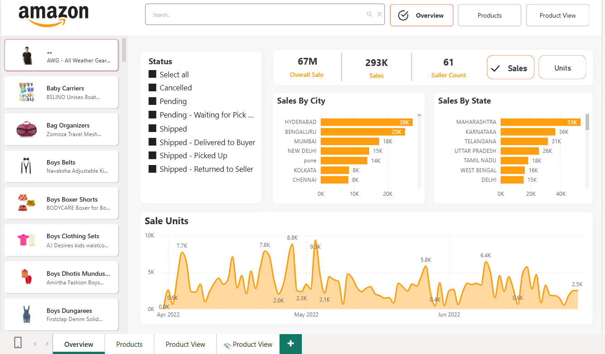
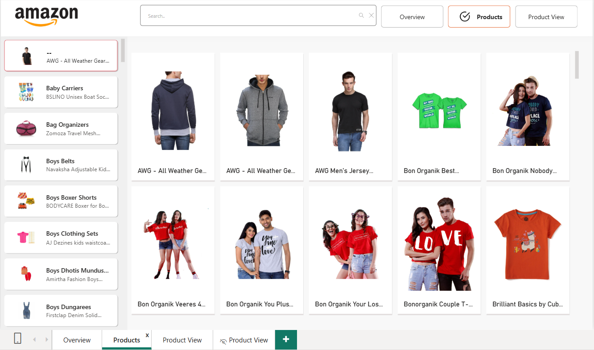

# Amazon_Power_BI

# Amazon_Power_BI

# 📊 Amazon Products on 2022

This project explores Amazon product data from the year 2022 using **Power BI** for both data cleaning and visualization. The goal is to extract actionable insights related to product categories, seller behavior, reviews, and sales trends.

## 📝 Overview

Using Power BI, the dataset was transformed and visualized to answer key business questions. The project focuses on uncovering category-level performance, monthly trends, and customer engagement through reviews.

## 📌 Key Insights

1. **Units Sold per Category**  
   Identifies which product categories saw the highest volume of sales.

2. **Sales per Category**  
   Measures the total revenue generated by each product category.

3. **Number of Sellers per Category**  
   Highlights how many unique sellers are operating in each product category.

4. **Monthly Sales Trends**  
   Tracks how sales evolved over the year and pinpoints the top-performing month.

5. **Status Distribution by Category**  
   Analyzes product status (e.g., active, discontinued) across categories.

6. **Review Count per Category**  
   Measures customer engagement and interest through the number of reviews.

## 📂 Dataset

The dataset includes product-level information such as:
- Product name
- Category
- Seller name
- Units sold
- Sales revenue
- Number of reviews
- Product status
- Sale date

## 📊 Dashboard

The Power BI dashboard provides interactive visuals for all insights above, including slicers for time-based filtering and category-wise comparisons.

## 🛠️ Tools Used

- **Power BI** for:
  - Data cleaning
  - Data modeling
  - Data visualization

## 🚀 Getting Started

To view the dashboard:
1. Clone or download the repository
2. Open the `.pbix` file in Power BI Desktop
3. Explore visuals and interact with filters and slicers
